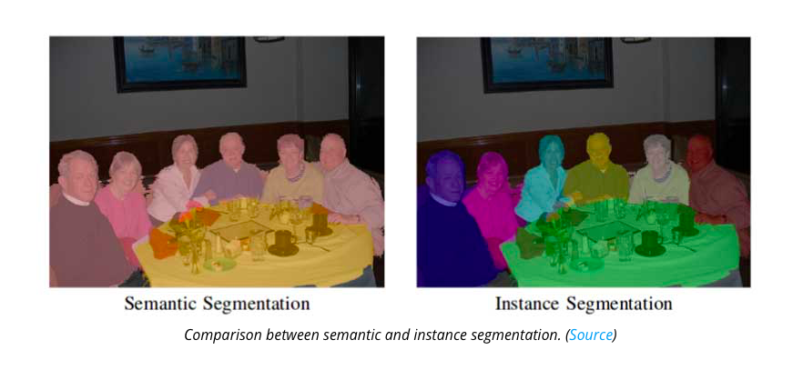

# Semantic Segmentation
[](https://mybinder.org/v2/gh/adityak2920/semantic-segmentation/c7245c6ba024982aec0bb54aebdb059ecdf21da0)

  Semantic Segmentation is the process of assigning a label to every pixel in the image. This is in contrast to classification, where a single label is assigned to the entire picture. Semantic segmentation treats multiple objects of the same class as a single entity. On the other hand, there is another type called instance segmentation that treats multiple objects of the same class as distinct individual objects (or instances).
  

  
In this repo, I have only shown how to use different semantic segmentation architectures using different frameworks and libraries like fastai, PyTorch, segmentation_models, etc.

Before using these notebooks, run the command:                                                                                 
    ```pip install -r requirements.txt```
   
Then in the ```notebooks/``` section there are several notebooks:
  1. ```DeepLabV3.ipynb```: This notebook contains code for training deeplab model where model architecture is taken from ```torchvision``` and training is implemented using ```fastai```.
  2. ```U-Net(fastai).ipynb```: fastai is great library for classification and semantic segmentation tasks specially when it comes to U-Net.So, in this notebook I have implemented training of UNet using fastai only.
  3. ```U-Net(from scratch).ipynb```: In this notebook, I have not used any library build on top of ```PyTorch```. I am building UNet from scratch and then training using torch only.
  4. ```U-Net(using smp).ipynb```: [segmentation_models_pytorch](https://github.com/qubvel/segmentation_models.pytorch) is a great library built on top of pytorch to train segmentation models easily. There are several architectures implemented like FPN, U-Net, PSPNet, etc. So, this notebook shows how to train models using ```segmentation_models_pytorch```.
  5. ```fpn_segmentation.ipynb```: Code for training ```Feature Pyramid Network(FPN)``` for segmentation using ```segmentation_models_pytorch```.
  
  
I have used these notebooks mainly in Kaggle competition for semantic Segmentation.
